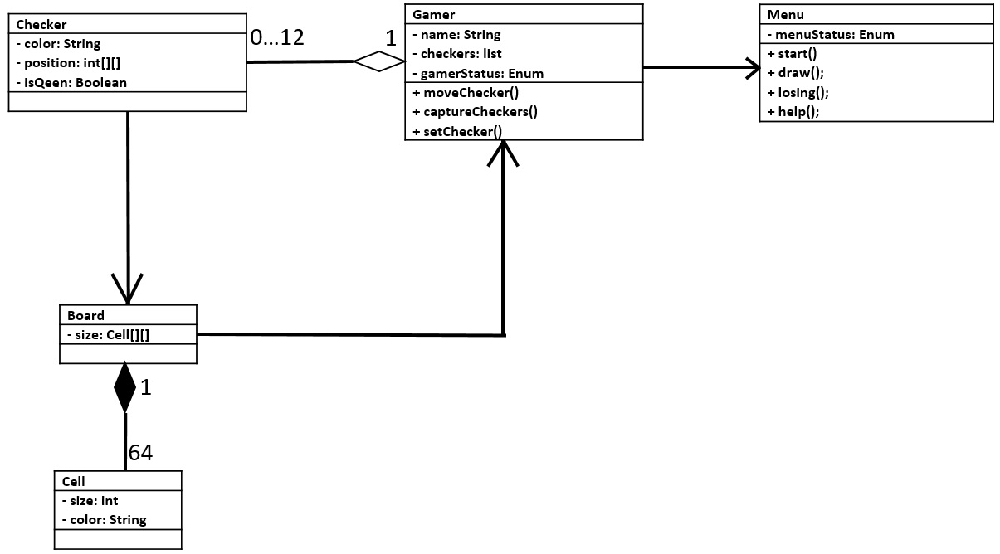

# Requirements for a system
## Functional requirements
1. The Object of the game: pieces (checkers) and a board.
2. Number of players: automatic 1 (play with computer), optional 2 (play against each other)
3. At the start of the game, the pieces are automatically placed in position.
4. Victory: 
    * by agreement of the parties; 
    * if the opponent has no pieces.
5. Draw:
    * by agreement of the parties;
    * if there has been no capture of a piece after 15 moves
6. When a pawn reaches the opposite edge of the board, it becomes a queen.
7. Game menu.
## Non-functional
1. Gameplay visualization. 
2. Registration at the entrance to the game.
3. Guide describing the rules of the game
4. Various difficulty levels.
# Use cases
## 1. Launching the game
| Item use case | Description |
|:-----------|:------------|
| __Acting persons__ | System, player |
| __Goal__ | Start game. |
| __Successful scenario__ | 1. The player launches the application.
|| 2. The system launches the application and displays the "START " button.
|| 3. The player presses the "START" button.
|| 4. The system offers to choose the color of the checkers.
|| 5. The player chooses the color of checkers.
|| 6. The system places checkers in their original positions. The player with white checkers is given the right of the first move.
| __Result__ | The game is running. The color of the checkers is distributed among the participants in the game. The player with white checkers is waiting for the first move. |
## 2. Player turn
| Item use case | Description |
|:-----------|:------------|
| __Acting persons__ | System, gamer |
| __Goal__ | The player made a move |
| __Successful scenario__ | 1. The player chooses a checker to make his move.
|| 2. The system highlights the checker and switches it into an active state.
|| 3. The player indicates the place where the checker needs to be moved.
|| 4. The system moves the checker to the specified position and passes the move to another player.
| __Result__ | The player made a move |
| __Expansion__ | 1. If the move is unacceptable, the system issues a message about it.
|| 2. The player clicks "Allowed Moves". The system suggests the allowed moves with the selected checker.
|| 3. The player captures the opponent's checker (s) during his turn. The system removes the captured checker (s) from the game.
## 3. Victory
| Item use case | Description |
|:-----------|:------------|
| __Acting persons__ | System, gamer |
| __Goal__ | Winning the game|
| __Successful scenario__ | 1. Implement the "Player Turn" scenario.
|| 2. After player 1's move, player 2 has no checkers.
|| 3. The system issues a message about the victory of player 1 and offers to start a re-match / revenge.
| __Result__ | Victory |
| __Expansion__ | 1. If player 2 surrenders, the system issues a message that player 1 won.
|| 2. An active player can always choose to surrender or offer a draw from the menu.
## 4. Draw
| Item use case | Description |
|:-----------|:------------|
| __Acting persons__ | System, gamer |
| __Goal__ | Draw in the game  |
| __Successful scenario__ | 1. Implement the "Player Turn" scenario.
|| 2. The players made 15 unsuccessful moves.
|| 3. The system displays a message about a draw and offers to start over.
| __Result__ | Draw |
| __Expansion__ | 1. If the player cannot make a move within 3 minutes, the system offers to end the game in a draw or surrender.
|| 2. An active player can always choose to surrender or offer a draw from the menu.
## 5. The checker becomes a queen
| Item use case | Description |
|:-----------|:------------|
| __Acting persons__ | System, gamer |
| __Goal__ | The checker becomes a queen. |
| __Successful scenario__ | 1. Implement the "Player Turn" scenario.
|| 2. The player's checker has reached the opposite side of the board.
|| 3. The system switches the checker to the queen state.
| __Result__ | Checker became queen |
# Class diagram
<h2>
   
</h2>
