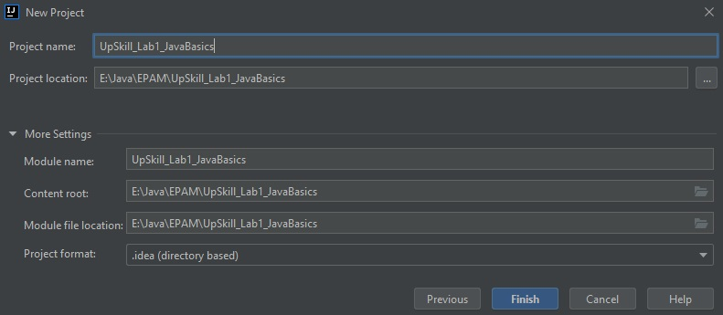
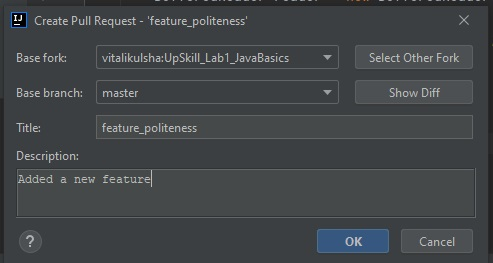

# Module "Git"
## Description
Create a simple program and share it on Gitlab. Add changes via creating a merge request.
## Steps
1. Write a simple Java program that reads a name from the standard input and prints "Hello, name".
2. Init:
    * Init git repo.
    * Commit initial files.
    * Share on Gitlab.
3. Merge a feature:
    * Create and checkout feature_politeness branch
    * Change program to print Nice to meet you. in addition to original output
    * Commit
    * Create a pull/merge request from grammar_check to master branch. Merge
    * Pull master branch in local repo and assure program is changed properly
4. Show or send your tutor confirming screenshots.
## Solution
#### 1. We create a new project and call it "UpSkill_Lab1_JavaBasics":
   
   

#### 2. We create a new module and call it "Git":
   
   

#### 3. We create a program "MyProgram":
   

#### 4. We create Git Repository:
   

#### 5. We mark files to add in GitHub:
   

#### 6. We add commit:
   

#### 7. We share project in GitHub:
   
   

#### 8. We check project in GitHub:
   

#### 9. We add new branch "feature_politeness" in master branch:
   
   
   

#### 10. We edit programm in branch "feature_politeness":
   

#### 11. We add commit and be push:
   
   

#### 12. We create pull request:
   
   
   
   

#### 13. We Go to the main branch:
   

#### 14. We merge branch "feature_politeness" in master branch:
   
   
   
   
   
