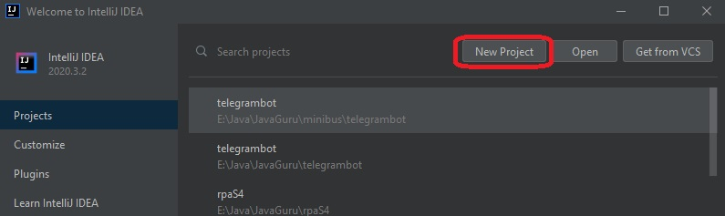
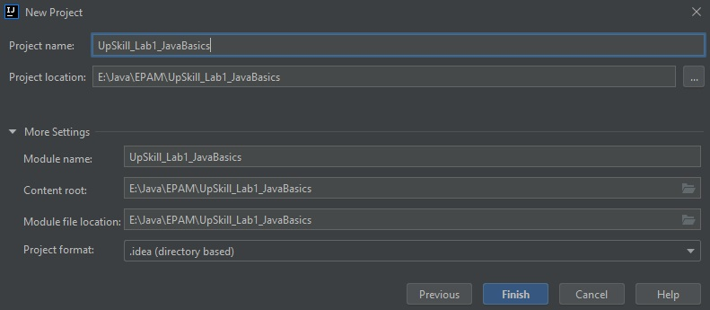

Module "Git"
=============

Description
-----------

Create asimple program and share it on Gitlab. Add changes via creating a merge request.

Steps
-----

#. Write a simple Java program that reads a name from the standard input and prints "Hello, name".
#. Init:
    * Init git repo.
    * Commit initial files.
    * Share on Gitlab.
#. Merge a feature:
    * Create and checkout feature_politeness branch
    * Change program to print Nice to meet you. in addition to original output
    * Commit
    * Create a pull/merge request from grammar_check to master branch. Merge
    * Pull master branch in local repo and assure program is changed properly
#. Show or send your tutor confirming screenshots.

Solution
-----------
#. We create a new project and call it "UpSkill_Lab1_JavaBasics":

2. We create a new module and call it "Git":

<h2>
   2. We create a new module and call it "Git":
   
   
</h2>

3. We create a program "MyProgram":

4. We create Git Repository:

5. We mark files to add in GitHub:

6. We add commit:

7. We share project in GitHub:

8. We check project in GitHub:

9. We add new branch "feature_politeness" in master branch:

10. We edit programm in branch "feature_politeness":

11. We add commit and be push:

12. We create pull request:

13. We Go to the main branch:

14. We merge branch "feature_politeness" in master branch:

