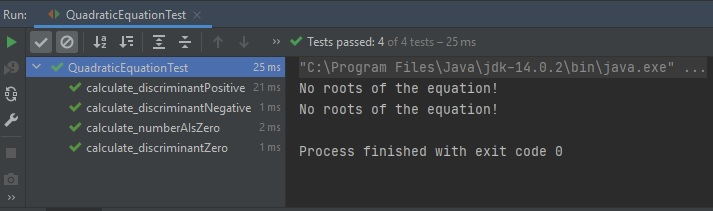

# Module "JUnit"
## Description
Write and cover with tests a method that solves a quadratic equation.
## Method specification
For the given quadratic equation coefficients **(ax2 + bx + c = 0)** return array with zero, one or two real roots of the equation. Roots in the array may be in any order. Specify behavior of infinite roots case by yourself.
## Tests specification
* Ensure that method works fine in general cases:
    * two existing roots
    * one exiting root
    * no roots
* Ensure method works correctly if some of coefficients equal zero
* Ensure method works correctly in special cases (like when all coefficients are zeros)
## Hint
[Quadratic formula reference](https://en.wikipedia.org/wiki/Quadratic_formula)
## Steps
* Complete the method
* Complete the tests (Tests may go first - TDD)
* Show the mentor your results
## Solution
#### 1. Created a project ["JUnit"](https://github.com/vitalikulsha/UpSkill_Lab1_JavaBasics/tree/master/JUnit) in maven
#### 2. File [pom.hml](https://github.com/vitalikulsha/UpSkill_Lab1_JavaBasics/blob/master/JUnit/pom.xml)
#### 3. [QuadraticEquation](https://github.com/vitalikulsha/UpSkill_Lab1_JavaBasics/blob/master/JUnit/src/main/java/QuadraticEquation.java) - file with the code for the testing
#### 4. [QuadraticEquationTest](https://github.com/vitalikulsha/UpSkill_Lab1_JavaBasics/blob/master/JUnit/src/test/java/QuadraticEquationTest.java) - test file
#### 5. Test results
<h2>
   
   
</h2>
