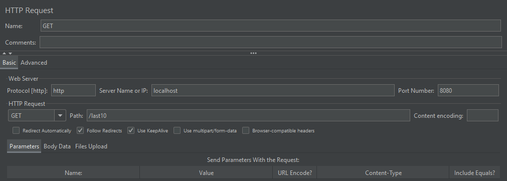

# Message Registry

Sample web application for load testing.

## Load Test Routine
1. Download and install following tools:
    - VisualVM: [https://visualvm.github.io/](https://visualvm.github.io/)
        - be sure to install VisualGC plugin
    - Memory Analyzer Tool (MAT): [https://www.eclipse.org/mat/](https://www.eclipse.org/mat/)
    - JMeter: [https://jmeter.apache.org/](https://jmeter.apache.org/)
    
1. Clone this repository.

1. Run the project as Spring Boot Application.
Set maximum heap size to 50 megabytes 
and set up a flag to get information,
what garbage collector implementation did JVM apply.

1. Connect to the application process via VisualVM 
and look at VisualGC interface to monitor heap state.

1. Setup and run a test plan in JMeter to load endpoints of the application:
   - POST /message - no parameters, add a sample message text as a Request Body
   - GET /last10 - no parameters or body
    
   Test plan should have a lot of threads and run forever.
   
1. Monitor heap state via VisualVM and wait until heap will stuck. Then make a heap dump.

1. Use MAT to analyze the heap dump and describe occurred problems.

1. Suggest a solution to discovered problems.

# Solution

## [Message Registry Load Test](https://gitlab.com/efimchick-training-tasks/message-registry-load-tes)

## Run the project as a Spring Boot application with the given parameters

## Connect to the application process via VisualVM

## Setup and run a test plan in JMeter to load endpoints of the application

## Monitor heap state via VisualVM and wait until heap will stuck. Then make a heap dump.

## Results of work at JMeter

## Analyzing a heap dump using MAT

