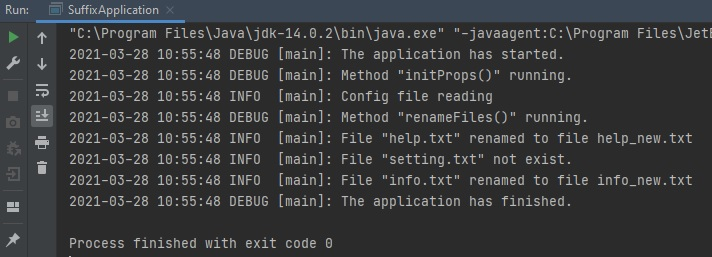

# Module "Logging"
## Description
Get Suffixing App project from Maven topic. Add logging.
## App Specification
It is a Suffixing App - a small java application that refers to a config file and renames a set of files and renames them adding a suffix specified in the same config.
## Details:
* Application should read a config file on the startup
* Then it should ensure that all of files from the config exist
* Then it should rename each file adding a suffix from the config to its name
## Logging Specification
* Application should log startup information.
* Application should log information on config read.
* Application should log renaming process information.
* Application should log summary information.
* Application should log shutdown information.
* Application should handle and log possible errors.
Use different logging level. All log entries should contain a date and time information as well.
## Steps
1. Complete the project to meet specifications.
2. Show the mentor your results.

## Solution
#### 1. Created a file [pom.hml](https://github.com/vitalikulsha/UpSkill_Lab1_JavaBasics/blob/master/Logging/pom.xml) 
#### 2. Created a [config file](https://github.com/vitalikulsha/UpSkill_Lab1_JavaBasics/blob/master/Logging/src/main/resources/config.properties) 
#### 3. Created a [config java file](https://github.com/vitalikulsha/UpSkill_Lab1_JavaBasics/blob/master/Logging/src/main/resources/Config.java) 
#### 4. Created a [util class](https://github.com/vitalikulsha/UpSkill_Lab1_JavaBasics/blob/master/Logging/src/main/java/FileUtil.java) with variables and methods
#### 5. Created a [class to run the application](https://github.com/vitalikulsha/UpSkill_Lab1_JavaBasics/blob/master/Logging/src/main/java/SuffixApplication.java)
#### 6. Console output 
<h2>
   
</h2>
