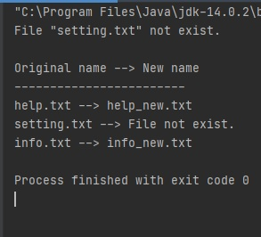

# Module "Maven"
## Description
Use maven to build and control a simple Java program with dependencies.
## App Specification
It is a Suffixing App - a small java application that refers to a config file and renames a set of files and renames them adding a suffix specified in the same config.
## Details:
* Application should read a config file on the startup
* Then it should ensure that all of files from the config exist
* Then it should rename each file adding a suffix from the config to its name
* It should print the results of the renaming like:
*old_name -> new_name*
## Steps
1. Create a maven project and specify its GAV settings, encoding, language level, etc.
2. Add a dependency to some library for reading and parsing JSON files. (for instance, GSON)
3. Write the code implementing the app specification.
4. Configure maven project to build a runnable jar containing application and its dependencies.
5. Show the mentor your results.
## Solution
#### 1. Created a file [pom.hml](https://github.com/vitalikulsha/UpSkill_Lab1_JavaBasics/blob/master/Maven/pom.xml) 
#### 2. Created a [config file](https://github.com/vitalikulsha/UpSkill_Lab1_JavaBasics/blob/master/Maven/src/main/resources/config.properties) 
#### 3. Created a [config java file](https://github.com/vitalikulsha/UpSkill_Lab1_JavaBasics/blob/master/Maven/src/main/java/Config.java) 
#### 4. Created a [util class](https://github.com/vitalikulsha/UpSkill_Lab1_JavaBasics/blob/master/Maven/src/main/java/FileUtil.java) with variables and methods
#### 5. Created a [class to run the application](https://github.com/vitalikulsha/UpSkill_Lab1_JavaBasics/blob/master/Maven/src/main/java/SuffixApplication.java)
#### 6. Console output 
<h2>
   
</h2>
