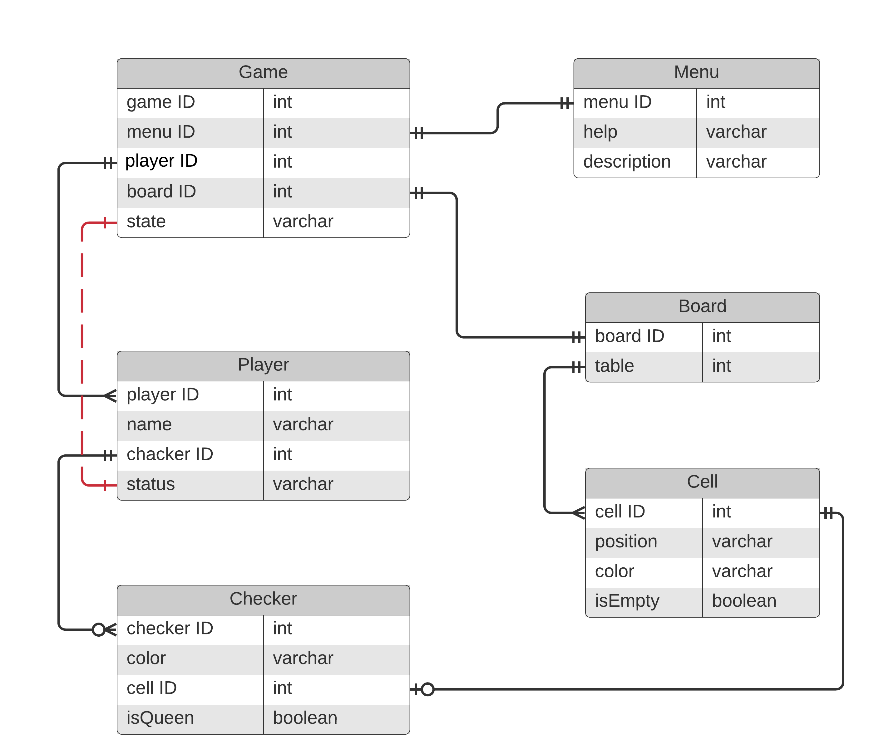

# SOLUTION
## Functional requirements
1. The Object of the game: pieces (checkers) and a board.
2. Number of players: automatic 1 (play with computer), optional 2 (play against each other)
3. At the start of the game, the pieces are automatically placed in position.
4. Victory: 
    * by agreement of the parties; 
    * if the opponent has no pieces.
5. Draw:
    * by agreement of the parties;
    * if there has been no capture of a piece after 15 moves
6. When a pawn reaches the opposite edge of the board, it becomes a queen.
7. Game menu.
## Non-functional
1. Gameplay visualization. 
2. Registration at the entrance to the game.
3. Guide describing the rules of the game.
4. Change the state of the game.
## Description of design entities
| Entities | Attributes | Relationships |
|:----------------|:---------------|:--------------------|
| __Game__ | id: int   board: Board   player: Player   state: Enum   menu: Menu| When the system starts up, a game is created. When the game starts, a game board is created and the players are automatically set to the initial state of the game. The game state can be forcedly changed from the menu. The game state changes automatically depending on the player's status. Game state: startGame, gameOver, pauseGame. |
| __Player__ | id: int   name: String   checkers: Checker   status: Enum | Each player has a name, their own set of checkers, and an initial status. The player can move checkers according to the rules. By moving a checker, the player changes its position on the board. The player has a status that affects the state of the game. The player's status changes automatically depending on the position of the player's checkers and affects the state of the game. Player status: win, draw, lose. |
|__Checker__|id: int   color: String   cell: Cell   isQueen: boolean | A checker has a color, cell membership and status. The checker moves around the board with the help of the player. When you move a checker, the cell on which the checker stands changes. One player can only have checkers of one specific color. |
|__Board__|id: int   table: Cell | The game board consists of a set of black and white cells. |
|__Cell__|id: int   position: String   color: String   isEmpty: boolean| A cell has its own color, position on the board and state: empty or occupied by a checker. Checkers can only move along black squares and if this square is empty. |
|__Menu__|id: int   help: String   description:String | In the menu, you can select help, a description of the game. |
## ER-diagram

