# Home task "Design a REST API"
## Description
Discuss with a tutor choosing one of the following variants of a system to design REST API for.
* Catalogue:
    - Campus: rooms, occupation;
    - Library: books authors, categories;
    - Storehouse: storage space, goods, orders;
    - Store: goods, amounts, prices, discounts;
    - ...
* Logging:
    - Ship log: entries, events, dates;
    - Server logs: events, severity, instances;
    - ...
* Scheduling/Alerting systems:
    - Zoo animals nutrition scheduling and alerting;
    - Education activities deadlines scheduling and alerting;
    - IT department tickets scheduling and alerting;
    - ...

Then follow the steps described below.

## Steps

* Describe, what entities must it use.
* Describe, what operations with these functions must the system support.
* Design REST API including collections, filters, pagination, etc.
* Show or send a mentor the following results: Entities & Operations description, REST API description.

## Solution

The "Library" system contains two objects: category and author. The "Сategory" object has fields for id, title, and author list. The "Аuthor" object contains fields for the id, author's first and last name, book and category. Tables are linked by category id.

### ER-diagram
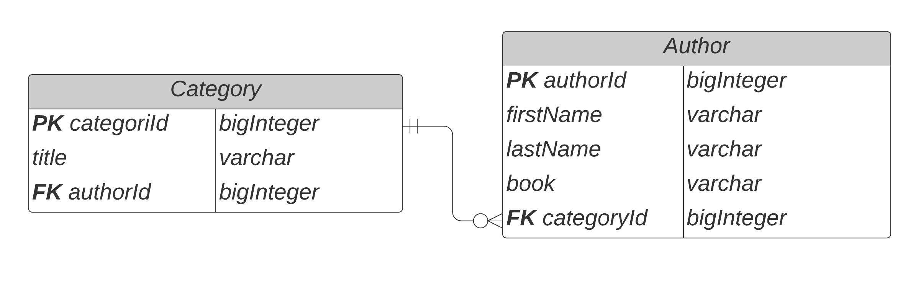

The "Category" object supports the following operations:

* adding a category to the database;
* getting a category by id;
* getting a category by title;
* getting all categories;
* category update;
* cascading category deletion.

The "Author" object supports the following operations:

* adding an author to the database by category id;
* getting author by id;
* getting all authors;
* author update;
* deleting an author.

### Adding a category to the database

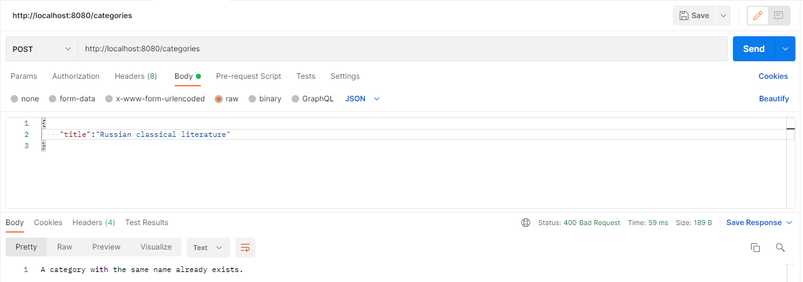

## Getting a category by id from the database
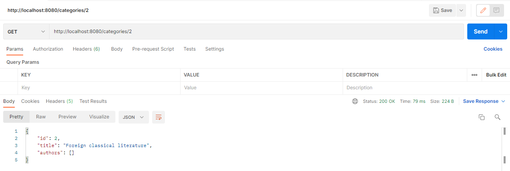

## Getting a category by title from the database
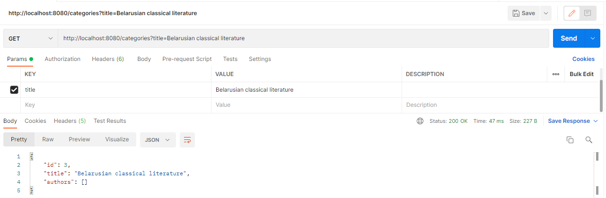
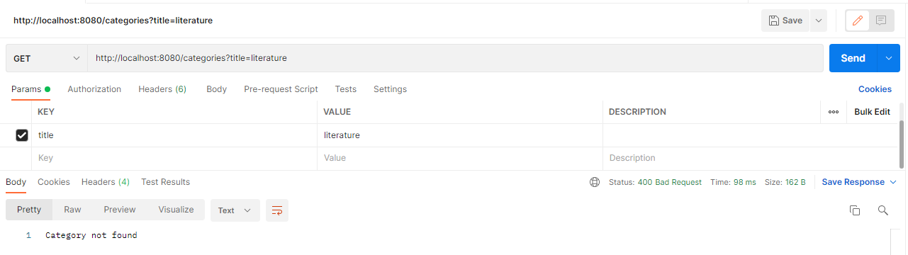

## Getting all categories from the database
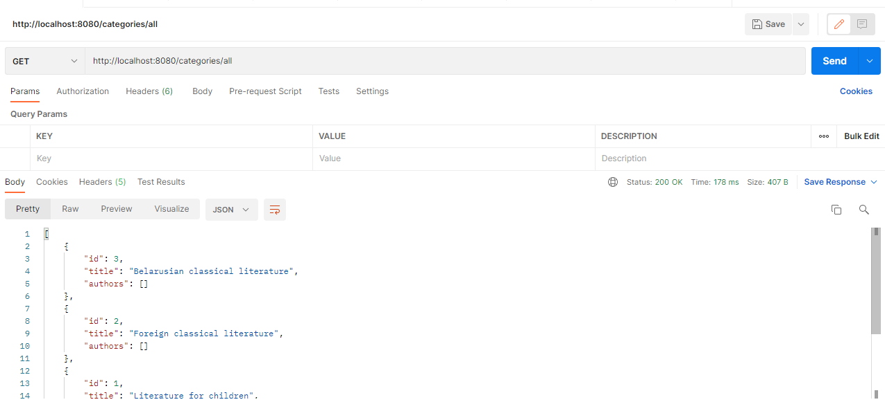
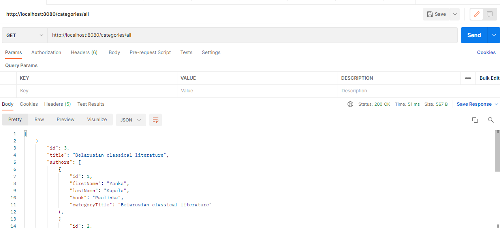
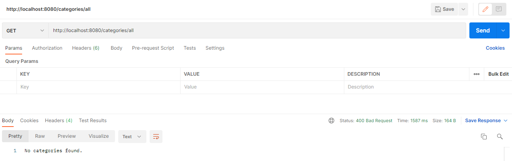

## Category update

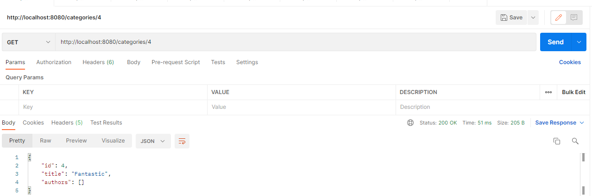

## Cascading category deletion

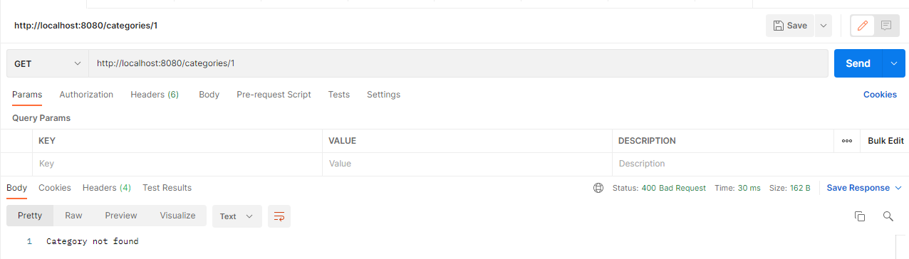

## Adding an author to the database by category id
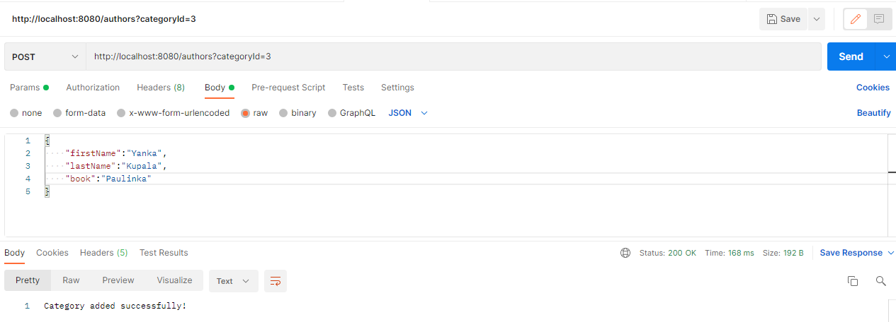
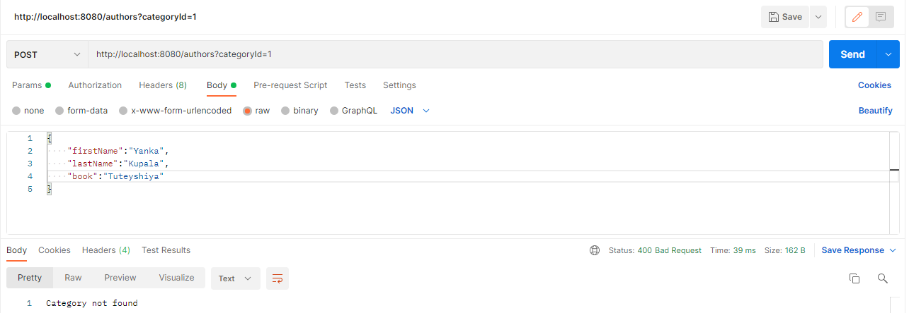

## Getting author by id from the database
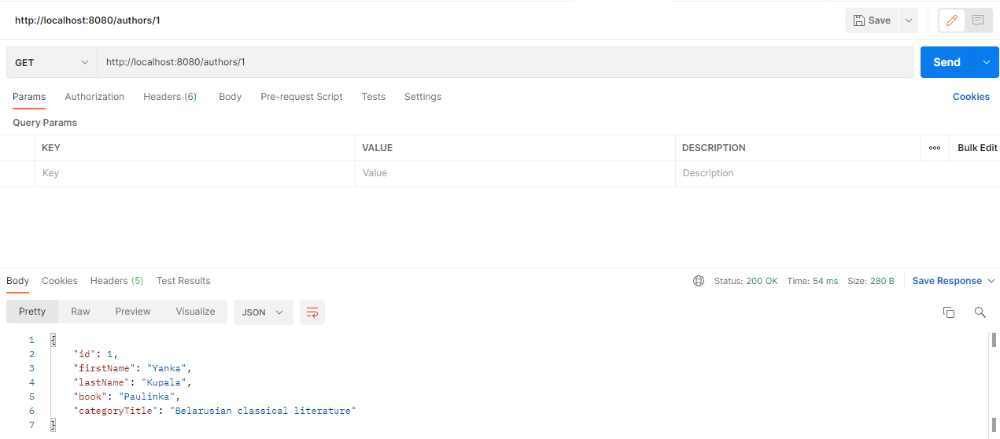
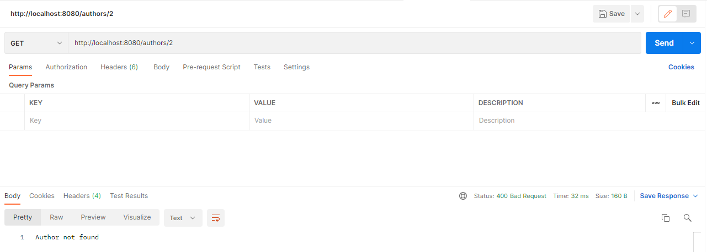

## Getting all authors from the database
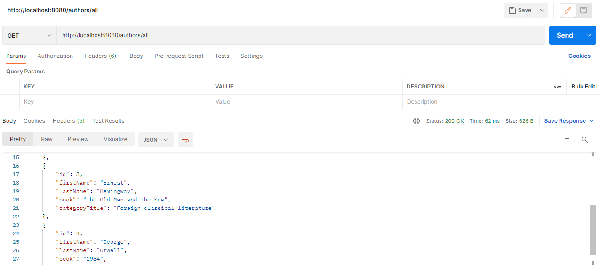
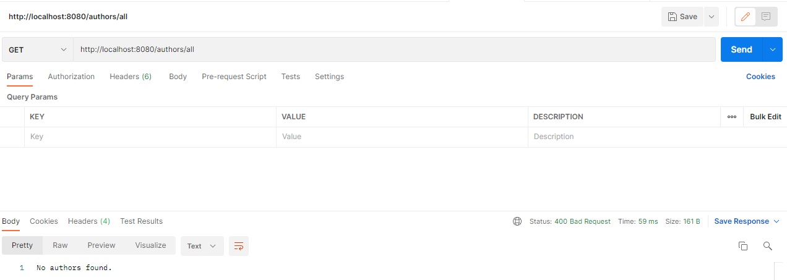
